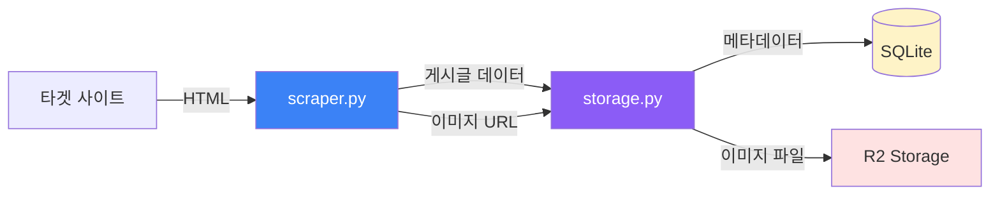
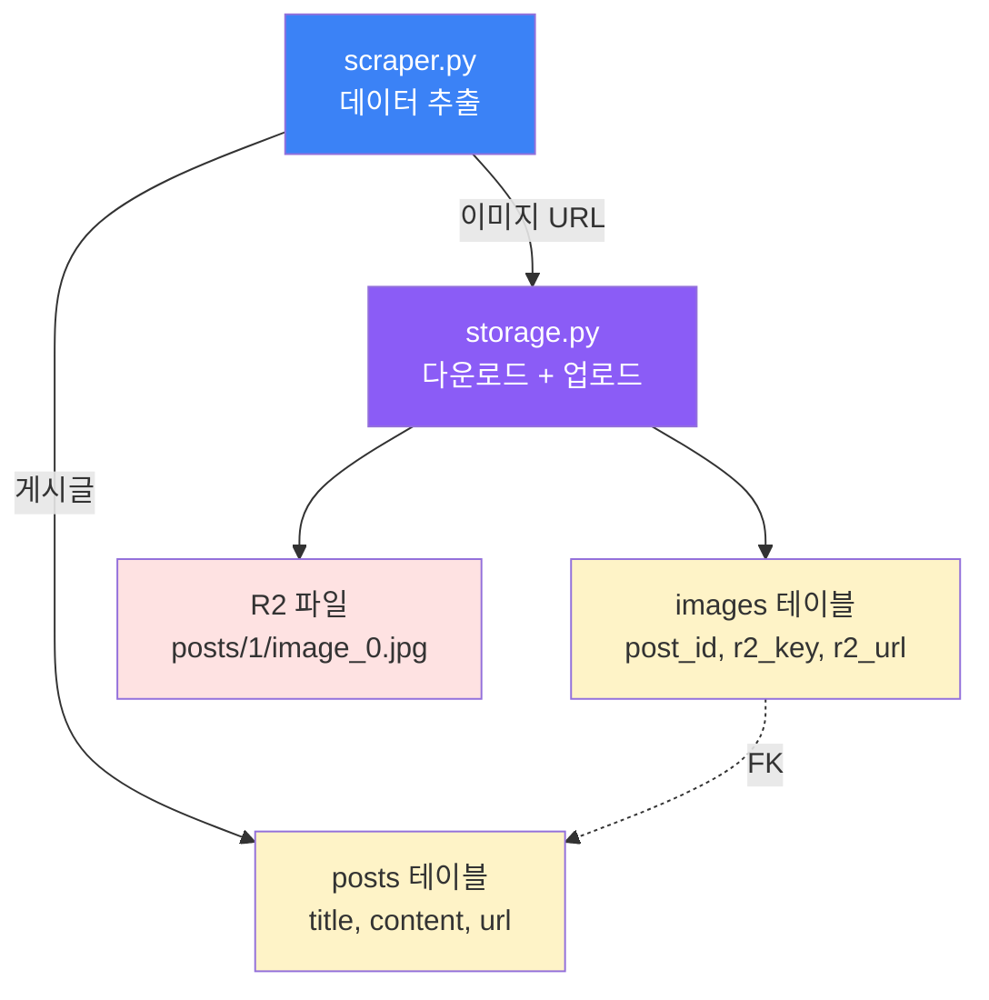
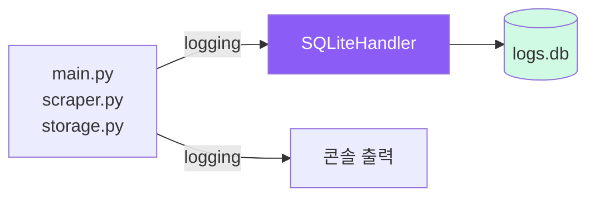

# 크롤러 아키텍처

## scraper.py → storage.py 데이터 흐름

```mermaid
graph LR
    Web[타겟 사이트] -->|HTML| Scraper[scraper.py]

    Scraper -->|게시글 데이터| Storage[storage.py]
    Scraper -->|이미지 URL| Storage

    Storage -->|메타데이터| DB[(SQLite)]
    Storage -->|이미지 파일| R2[R2 Storage]

    style Scraper fill:#3b82f6,color:#fff
    style Storage fill:#8b5cf6,color:#fff
    style DB fill:#fef3c7
    style R2 fill:#fee2e2
```

## 데이터 저장 구조

```mermaid
graph TB
    Scraper[scraper.py<br/>데이터 추출] -->|게시글| Posts[posts 테이블<br/>title, content, url]
    Scraper -->|이미지 URL| Download[storage.py<br/>다운로드 + 업로드]

    Download --> Images[images 테이블<br/>post_id, r2_key, r2_url]
    Download --> R2Files[R2 파일<br/>posts/1/image_0.jpg]

    Images -.->|FK| Posts

    style Scraper fill:#3b82f6,color:#fff
    style Download fill:#8b5cf6,color:#fff
    style Posts fill:#fef3c7
    style Images fill:#fef3c7
    style R2Files fill:#fee2e2
```

## 로깅 시스템

```mermaid
graph LR
    Modules[main.py<br/>scraper.py<br/>storage.py] -->|logging| Handler[SQLiteHandler]
    Handler --> LogsDB[(logs.db)]

    Modules -->|logging| Console[콘솔 출력]

    style Handler fill:#8b5cf6,color:#fff
    style LogsDB fill:#d1fae5
```
