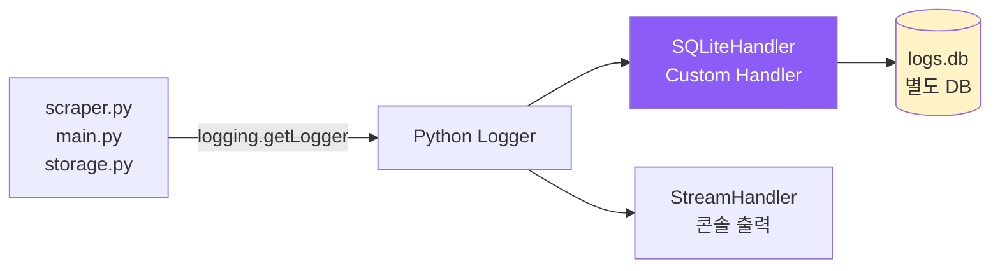
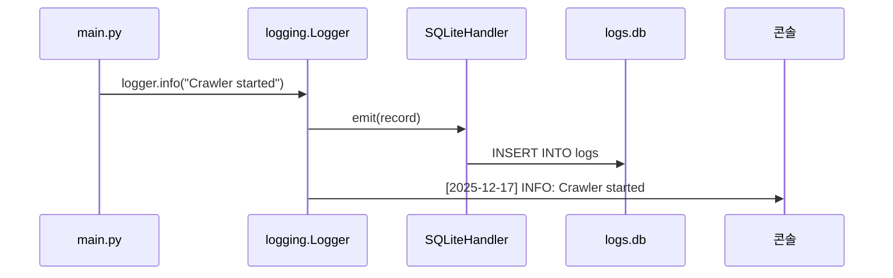

# logging.py

## 개요

크롤러 로그를 SQLite 데이터베이스에 영구 저장하는 모듈

## 로깅 아키텍처



## 주요 책임

- Python `logging` 모듈과 통합
- SQLite에 로그 레코드 저장
- 로그 검색 및 분석 지원
- 자동 로그 정리 (오래된 로그 삭제)

## 데이터베이스 스키마

### logs 테이블

```sql
CREATE TABLE logs (
    id INTEGER PRIMARY KEY AUTOINCREMENT,
    timestamp DATETIME DEFAULT CURRENT_TIMESTAMP,
    level TEXT NOT NULL,          -- DEBUG, INFO, WARNING, ERROR, CRITICAL
    level_no INTEGER NOT NULL,    -- 10, 20, 30, 40, 50
    logger TEXT NOT NULL,         -- 모듈명 (__name__)
    message TEXT NOT NULL,
    function TEXT,                -- 함수명
    line_number INTEGER,          -- 라인 번호
    exception TEXT,               -- 예외 발생 시 traceback
    extra_data TEXT               -- JSON 형태의 추가 데이터
);

-- 인덱스 (쿼리 성능 최적화)
CREATE INDEX idx_logs_timestamp ON logs(timestamp);
CREATE INDEX idx_logs_level ON logs(level);
CREATE INDEX idx_logs_logger ON logs(logger);
```

## 핵심 기능

### 1. SQLiteHandler 클래스

```python
import logging
import sqlite3
import traceback
from datetime import datetime
import json

class SQLiteHandler(logging.Handler):
    """SQLite에 로그를 저장하는 커스텀 핸들러"""

    def __init__(self, db_path: str = "../data/logs.db"):
        super().__init__()
        self.db_path = db_path
        self._init_db()

    def _init_db(self):
        """데이터베이스 및 테이블 초기화"""
        with sqlite3.connect(self.db_path) as conn:
            conn.execute("""
                CREATE TABLE IF NOT EXISTS logs (
                    id INTEGER PRIMARY KEY AUTOINCREMENT,
                    timestamp DATETIME DEFAULT CURRENT_TIMESTAMP,
                    level TEXT NOT NULL,
                    level_no INTEGER NOT NULL,
                    logger TEXT NOT NULL,
                    message TEXT NOT NULL,
                    function TEXT,
                    line_number INTEGER,
                    exception TEXT,
                    extra_data TEXT
                )
            """)
            conn.execute("CREATE INDEX IF NOT EXISTS idx_logs_timestamp ON logs(timestamp)")
            conn.execute("CREATE INDEX IF NOT EXISTS idx_logs_level ON logs(level)")
            conn.commit()

    def emit(self, record: logging.LogRecord):
        """로그 레코드를 SQLite에 저장"""
        try:
            # 예외 정보 포맷팅
            exc_text = None
            if record.exc_info:
                exc_text = ''.join(traceback.format_exception(*record.exc_info))

            # extra 데이터 (있으면)
            extra_data = None
            if hasattr(record, 'extra'):
                extra_data = json.dumps(record.extra)

            with sqlite3.connect(self.db_path) as conn:
                conn.execute("""
                    INSERT INTO logs (
                        timestamp, level, level_no, logger, message,
                        function, line_number, exception, extra_data
                    ) VALUES (?, ?, ?, ?, ?, ?, ?, ?, ?)
                """, (
                    datetime.fromtimestamp(record.created).isoformat(),
                    record.levelname,
                    record.levelno,
                    record.name,
                    record.getMessage(),
                    record.funcName,
                    record.lineno,
                    exc_text,
                    extra_data
                ))
                conn.commit()
        except Exception:
            self.handleError(record)
```

### 2. 로그 검색 기능

```python
class LogQuery:
    """로그 검색 및 분석 유틸리티"""

    def __init__(self, db_path: str = "../data/logs.db"):
        self.db_path = db_path

    def get_recent_logs(self, limit: int = 100) -> List[Dict]:
        """최근 로그 조회"""
        with sqlite3.connect(self.db_path) as conn:
            conn.row_factory = sqlite3.Row
            cursor = conn.execute(
                "SELECT * FROM logs ORDER BY timestamp DESC LIMIT ?",
                (limit,)
            )
            return [dict(row) for row in cursor.fetchall()]

    def get_errors(self, since: datetime = None) -> List[Dict]:
        """에러 로그 조회"""
        query = "SELECT * FROM logs WHERE level IN ('ERROR', 'CRITICAL')"
        params = []
        if since:
            query += " AND timestamp >= ?"
            params.append(since.isoformat())
        query += " ORDER BY timestamp DESC"

        with sqlite3.connect(self.db_path) as conn:
            conn.row_factory = sqlite3.Row
            cursor = conn.execute(query, params)
            return [dict(row) for row in cursor.fetchall()]

    def get_stats(self) -> Dict:
        """로그 통계"""
        with sqlite3.connect(self.db_path) as conn:
            cursor = conn.execute("""
                SELECT level, COUNT(*) as count
                FROM logs
                GROUP BY level
            """)
            return {row[0]: row[1] for row in cursor.fetchall()}
```

### 3. 로그 정리 기능

```python
def cleanup_old_logs(db_path: str, days: int = 30):
    """오래된 로그 삭제"""
    with sqlite3.connect(db_path) as conn:
        conn.execute("""
            DELETE FROM logs
            WHERE timestamp < datetime('now', ?)
        """, (f'-{days} days',))
        conn.commit()
```

## 데이터 흐름



## 설정

### main.py 로깅 초기화

```python
import logging

from config import Config
from logging_db import setup_logging

# 로깅 설정 (SQLite + 콘솔)
logger = setup_logging(
    db_path=Config.LOGGING["db_path"],
    level=logging.INFO,
    console=True,
)
logger = logging.getLogger(__name__)
```

## 의존성

- `logging`: Python 표준 라이브러리
- `sqlite3`: Python 표준 라이브러리
- `json`: Python 표준 라이브러리

## 환경 변수

```bash
# 로그 DB 경로 (선택적)
LOGS_DB_PATH=../data/logs.db

# 로그 보관 기간 (일, 선택적)
LOGS_RETENTION_DAYS=30
```

## config.py 설정 추가

```python
# 로깅 설정
LOGGING = {
    "db_path": os.getenv("LOGS_DB_PATH", "../data/logs.db"),
    "retention_days": int(os.getenv("LOGS_RETENTION_DAYS", "30"))
}
```

## 사용 예시

```python
from logging_db import SQLiteHandler, LogQuery
import logging

# 로거 설정
logger = logging.getLogger(__name__)
handler = SQLiteHandler("../data/logs.db")
logger.addHandler(handler)

# 로그 기록
logger.info("Crawler started")
logger.warning("Page not found: https://example.com/123")
logger.error("Failed to connect", exc_info=True)

# 로그 조회
query = LogQuery("../data/logs.db")

# 최근 로그 100개
recent = query.get_recent_logs(100)

# 에러만 조회
errors = query.get_errors()

# 통계
stats = query.get_stats()
# {'INFO': 150, 'WARNING': 20, 'ERROR': 5}
```

## 로그 분석 쿼리 예시

```sql
-- 오늘 에러 로그
SELECT * FROM logs
WHERE level = 'ERROR'
AND date(timestamp) = date('now');

-- 모듈별 에러 카운트
SELECT logger, COUNT(*) as error_count
FROM logs
WHERE level IN ('ERROR', 'CRITICAL')
GROUP BY logger
ORDER BY error_count DESC;

-- 시간대별 로그 볼륨
SELECT strftime('%H', timestamp) as hour, COUNT(*) as count
FROM logs
GROUP BY hour
ORDER BY hour;

-- 특정 메시지 검색
SELECT * FROM logs
WHERE message LIKE '%Failed to parse%'
ORDER BY timestamp DESC;
```
