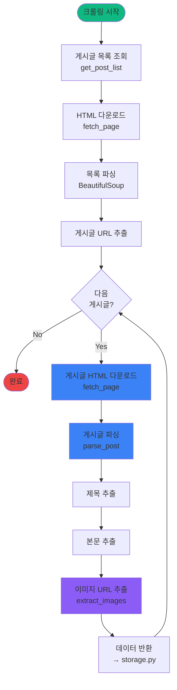

# scraper.py

## 개요

타겟 사이트의 HTML을 파싱하고 필요한 데이터를 추출하는 핵심 모듈

## 크롤링 프로세스



## 주요 책임

- 타겟 사이트 HTML 다운로드
- BeautifulSoup을 이용한 HTML 파싱
- 게시글 제목, 본문, 이미지 URL 추출
- 데이터 정규화 및 검증

## 핵심 기능

### 1. HTML 파싱

```python
def fetch_page(url: str) -> BeautifulSoup:
    """타겟 페이지의 HTML을 가져와 파싱"""
    - User-Agent 설정 (초기화 시 주입)
    - Timeout 처리
    - HTML 파싱 (BeautifulSoup)
```

**User-Agent 설정**:

- `Scraper` 초기화 시 `user_agent` 파라미터로 주입
- `Config.USER_AGENTS` 리스트에서 랜덤 선택하여 봇 차단 방지

### 2. 게시글 목록 추출

```python
def get_post_list(page_num: int) -> List[Dict]:
    """게시글 목록 페이지에서 게시글 URL 추출"""
    - 페이지네이션 처리
    - 게시글 링크 추출
    - 중복 제거
```

### 3. 게시글 상세 파싱

```python
def parse_post(url: str) -> Dict:
    """개별 게시글에서 데이터 추출"""
    - 제목 추출
    - 본문 텍스트 추출
    - 이미지 URL 리스트 추출
    - 작성일 파싱 (parse_date 사용)
```

### 4. 날짜 파싱

```python
def parse_date(date_text: str) -> Optional[datetime]:
    """날짜 텍스트를 datetime 객체로 파싱"""
    - dateutil.parser를 사용한 자동 파싱
    - 다양한 날짜 형식 자동 인식 ("2025-12-17", "2025.12.17 14:30" 등)
    - 파싱 실패 시 None 반환 및 경고 로그
```

**지원하는 날짜 형식 예시**:

- `2025-12-17`
- `2025.12.17 14:30`
- `Dec 17, 2025`
- `17/12/2025`
- `fuzzy=True` 옵션으로 텍스트 내 날짜 추출

### 5. 이미지 URL 추출

```python
def extract_images(soup: BeautifulSoup) -> List[str]:
    """본문에서 이미지 URL 추출"""
    -  태그 파싱
    - 상대 경로 → 절대 경로 변환
    - 유효한 이미지 URL 필터링
```

## 데이터 구조

### 추출된 게시글 데이터

```python
{
    "title": "게시글 제목",
    "content": "본문 텍스트 내용...",
    "source_url": "https://example.com/post/12345",
    "created_at": "2025-12-17T14:20:00",
    "images": [  # 항상 1개 이상 존재
        "https://example.com/images/1.jpg",
        "https://example.com/images/2.jpg"
    ]
}
```

## 타겟 사이트별 선택자 (예시)

### 게시글 목록

```python
SELECTORS = {
    "post_list": "div.post-item",
    "post_link": "a.post-title",
    "post_title": "h2.title",
    "post_content": "div.content",
    "post_images": "div.content img",
    "post_date": "span.date"
}
```

## 에러 처리

### 커스텀 예외 클래스

```python
class FetchError(Exception):
    """HTTP 요청 실패 시 발생하는 예외"""
    pass

class ParseError(Exception):
    """HTML 파싱 실패 시 발생하는 예외"""
    pass
```

### 에러 타입별 처리

- **404 Not Found**: `FetchError` 발생, 게시글 삭제로 간주하여 스킵
- **403 Forbidden**: `FetchError` 발생, IP 차단 감지 및 알림
- **Timeout**: `FetchError` 발생, 재시도 로직 (지수 백오프)
- **파싱 실패**: `ParseError` 발생, 로그 기록 후 다음 게시글로 진행
- **네트워크 오류**: `FetchError` 발생, 재시도 로직

### 예외 체이닝 (Exception Chaining)

모든 예외는 `raise ... from e` 패턴을 사용하여 원본 예외 정보를 보존합니다:

```python
except requests.HTTPError as e:
    if e.response.status_code == 404:
        raise FetchError(f"404 Not Found: {url}") from e  # 원본 예외 체이닝
    elif e.response.status_code == 403:
        raise FetchError(f"403 Forbidden: {url}") from e
    raise FetchError(f"HTTP Error {e.response.status_code}: {url}") from e
except requests.Timeout as e:
    raise FetchError(f"Timeout: {url}") from e
except requests.RequestException as e:
    raise FetchError(f"Network Error: {url} - {e}") from e
```

**장점**:

- 디버깅 시 원본 예외 traceback 확인 가능
- 예외 발생 원인 추적 용이

### 재시도 로직

```python
def fetch_page_with_retry(url: str, max_retries: int = 3) -> BeautifulSoup:
    """재시도 로직을 포함한 페이지 가져오기"""
    for attempt in range(max_retries):
        try:
            return fetch_page(url)
        except FetchError as e:
            if attempt == max_retries - 1:
                raise
            wait_time = 2 ** attempt  # 지수 백오프: 1초, 2초, 4초
            logger.warning(f"Retry {attempt+1}/{max_retries} after {wait_time}s: {e}")
            time.sleep(wait_time)
```

## 의존성

- `requests`: HTTP 요청
- `beautifulsoup4`: HTML 파싱
- `lxml`: 빠른 파서 백엔드
- `urllib.parse`: URL 처리
- `logging`: 로깅 (print 대신 사용)
- `time`: 재시도 지수 백오프
- `dateutil`: 유연한 날짜 파싱

## Rate Limiting

```python
import time

def crawl_with_delay(urls: List[str], delay: float = 1.0):
    """요청 간 딜레이를 두고 크롤링"""
    for url in urls:
        parse_post(url)
        time.sleep(delay)  # 1초 대기
```

## 사용 예시

```python
from scraper import Scraper
import random
from config import Config

# selectors는 사이트별로 정의
selectors = {
    "post_list": "div.post-item",
    "post_link": "a.post-title",
    "title": "h2.title",
    "content": "div.post-content",
    "images": "div.post-content img",
    "date": "span.date"
}

# User-Agent 랜덤 선택
user_agent = random.choice(Config.USER_AGENTS)

scraper = Scraper(
    base_url="https://example.com",
    selectors=selectors,
    user_agent=user_agent  # User-Agent 주입
)

# 게시글 목록 가져오기
posts = scraper.get_post_list(page_num=1)

# 각 게시글 파싱
for post_url in posts:
    data = scraper.parse_post(post_url)
    print(f"Title: {data['title']}")
    print(f"Date: {data['created_at']}")
    print(f"Images: {len(data['images'])}")
```
