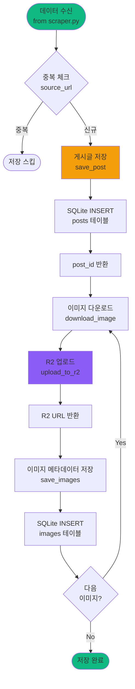
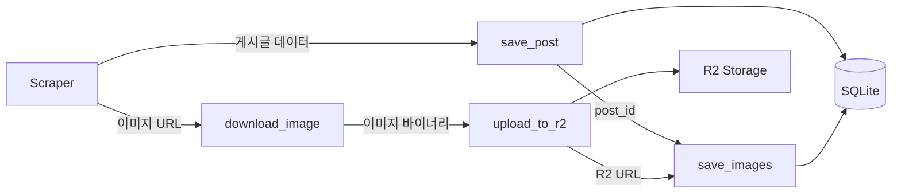

# storage.py

## 개요

크롤링한 데이터를 SQLite와 Cloudflare R2에 저장하는 모듈

## 저장 프로세스



## 주요 책임

- SQLAlchemy ORM을 통한 데이터베이스 관리
- 게시글 메타데이터 저장
- 이미지 다운로드 및 R2 업로드
- 중복 데이터 방지

## 핵심 기능

### 1. SQLAlchemy 모델 정의 (중복 처리 포함)

```python
from sqlalchemy import create_engine, Column, Integer, String, Text, DateTime, ForeignKey, Boolean, Float
from sqlalchemy.ext.declarative import declarative_base
from sqlalchemy.orm import sessionmaker, relationship
from datetime import datetime, timezone
import hashlib
import re
import os

Base = declarative_base()

class Post(Base):
    """게시글 모델"""
    __tablename__ = 'posts'

    id = Column(Integer, primary_key=True)
    site_name = Column(String(50), nullable=False)  # 사이트 구분
    title = Column(Text, nullable=False)
    content = Column(Text)
    content_hash = Column(String(64), index=True)  # 정규화 후 해시 (중복 감지)
    source_url = Column(Text, unique=True, nullable=False)
    created_at = Column(DateTime)
    crawled_at = Column(DateTime, default=lambda: datetime.now(timezone.utc))

    # 중복/관련 글 관리
    related_post_id = Column(Integer, ForeignKey('posts.id'))

    # 관계 설정
    images = relationship('Image', back_populates='post', cascade='all, delete-orphan')
    related_posts = relationship('Post', remote_side=[id], backref='derivatives')

class Image(Base):
    """이미지 모델"""
    __tablename__ = 'images'

    id = Column(Integer, primary_key=True)
    post_id = Column(Integer, ForeignKey('posts.id'), nullable=False)

    # 이미지 중복 감지용 해시
    md5_hash = Column(String(32), index=True)  # 정확한 매칭
    perceptual_hash = Column(String(16), index=True)  # 유사 이미지 매칭

    r2_key = Column(Text, nullable=False)
    r2_url = Column(Text, nullable=False)
    order_index = Column(Integer, default=0)
    uploaded_at = Column(DateTime, default=lambda: datetime.now(timezone.utc))
    is_similar_match = Column(Boolean, default=False)  # 유사 매칭 여부

    post = relationship('Post', back_populates='images')
```

### 2. 텍스트 정규화 함수

```python
def normalize_text(text: str) -> str:
    """텍스트 정규화 (중복 감지용)"""
    # 1. 소문자 변환
    text = text.lower()

    # 2. 공백 정리
    text = re.sub(r'\s+', ' ', text)

    # 3. 특수문자 제거 (ㅋ, ㅎ, !, ? 등)
    text = re.sub(r'[ㅋㅎ!?.~]+', '', text)

    # 4. 마침표, 쉼표 제거
    text = text.replace('.', '').replace(',', '')

    return text.strip()

def generate_content_hash(title: str, content: str) -> str:
    """정규화된 텍스트로 해시 생성"""
    normalized = normalize_text(f"{title}{content}")
    return hashlib.md5(normalized.encode()).hexdigest()
```

### 3. 이미지 해시 생성 함수

```python
import imagehash
from PIL import Image as PILImage
import io

def get_image_hash(image_data: bytes) -> tuple[str, str]:
    """
    이미지 해시 2개 반환:
    1. MD5: 정확히 같은 파일용
    2. pHash: 시각적으로 유사한 이미지용
    """
    # 1. MD5 해시
    md5_hash = hashlib.md5(image_data).hexdigest()

    # 2. Perceptual Hash
    image = PILImage.open(io.BytesIO(image_data))
    phash = str(imagehash.phash(image))

    return md5_hash, phash
```

### 4. 데이터베이스 관리

```python
class DatabaseManager:
    """SQLAlchemy를 이용한 데이터베이스 관리"""

    def __init__(self, db_path: str, r2_config: Optional[Dict] = None):
        """
        DB 엔진 및 세션 초기화

        Args:
            db_path: SQLite 데이터베이스 경로
            r2_config: R2 설정 딕셔너리 (account_id, access_key_id, secret_access_key, bucket_name)
        """
        engine = create_engine(f'sqlite:///{db_path}')

        # WAL 모드 설정 (SQLAlchemy 2.0 방식)
        with engine.connect() as connection:
            connection.execute(text("PRAGMA journal_mode=WAL"))
            connection.commit()

        Base.metadata.create_all(engine)
        Session = sessionmaker(bind=engine)
        self.session = Session()

        # R2 Uploader 초기화 (설정이 있으면)
        self.r2_uploader = None
        if r2_config:
            self.r2_uploader = R2Uploader(
                account_id=r2_config["account_id"],
                access_key=r2_config["access_key_id"],
                secret_key=r2_config["secret_access_key"],
                bucket_name=r2_config["bucket_name"],
            )

    def save_post(self, post_data: Dict, image_urls: List[str]) -> Optional[int]:
        """
        게시글 저장 (중복 체크 + 관련글 연결)

        Returns:
            post_id: 저장된 게시글 ID (중복이면 None)
        """
        # URL 중복 체크
        existing = self.session.query(Post).filter_by(
            source_url=post_data['source_url']
        ).first()

        if existing:
            return None

        # content_hash 생성
        content_hash = generate_content_hash(
            post_data['title'],
            post_data['content']
        )

        # 관련 게시글 찾기 (같은 이미지 사용)
        related_post = None
        if image_urls:
            # 첫 번째 이미지로 간단히 체크
            # (실제로는 모든 이미지 체크 가능)
            pass  # 아래 save_image_smart에서 처리

        # 새 게시글 생성
        post = Post(
            site_name=post_data['site_name'],
            title=post_data['title'],
            content=post_data['content'],
            content_hash=content_hash,
            source_url=post_data['source_url'],
            created_at=post_data.get('created_at'),
            related_post_id=None  # 나중에 이미지로 업데이트 가능
        )
        self.session.add(post)
        self.session.commit()
        return post.id

    def save_image_smart(self, post_id: int, image_url: str, order_index: int) -> Image:
        """
        이미지 저장 (2단계 중복 체크)
        1. MD5로 정확히 같은 파일 찾기
        2. pHash로 유사 이미지 찾기
        """
        # 이미지 다운로드
        img_data = self.download_image(image_url)

        # 해시 생성
        md5_hash, phash = get_image_hash(img_data)

        # ━━━━━━━━━━━━━━━━━━━━━━━━━━━━━━━━━━━
        # 1단계: 정확히 같은 파일 찾기 (MD5)
        # ━━━━━━━━━━━━━━━━━━━━━━━━━━━━━━━━━━━
        exact_match = self.session.query(Image)\
            .filter_by(md5_hash=md5_hash)\
            .first()

        if exact_match:
            # 완전히 같은 파일! R2 재사용
            image = Image(
                post_id=post_id,
                md5_hash=md5_hash,
                perceptual_hash=phash,
                r2_key=exact_match.r2_key,
                r2_url=exact_match.r2_url,
                order_index=order_index,
                is_similar_match=False
            )
            self.session.add(image)
            self.session.commit()
            return image

        # ━━━━━━━━━━━━━━━━━━━━━━━━━━━━━━━━━━━
        # 2단계: 유사한 이미지 찾기 (pHash)
        # ━━━━━━━━━━━━━━━━━━━━━━━━━━━━━━━━━━━
        all_images = self.session.query(
            Image.perceptual_hash,
            Image.r2_key,
            Image.r2_url
        ).all()

        for stored_phash, r2_key, r2_url in all_images:
            if not stored_phash:
                continue

            # 해밍 거리 계산
            h1 = imagehash.hex_to_hash(phash)
            h2 = imagehash.hex_to_hash(stored_phash)
            distance = h1 - h2

            if distance <= 5:  # 5비트 이하 차이 = 유사
                image = Image(
                    post_id=post_id,
                    md5_hash=md5_hash,
                    perceptual_hash=phash,
                    r2_key=r2_key,  # 유사 이미지의 R2 재사용
                    r2_url=r2_url,
                    order_index=order_index,
                    is_similar_match=True
                )
                self.session.add(image)
                self.session.commit()
                return image

        # ━━━━━━━━━━━━━━━━━━━━━━━━━━━━━━━━━━━
        # 3단계: 새 이미지 → R2 업로드
        # ━━━━━━━━━━━━━━━━━━━━━━━━━━━━━━━━━━━
        r2_key = f"images/{md5_hash}.jpg"
        r2_url = self.upload_to_r2(img_data, r2_key)

        image = Image(
            post_id=post_id,
            md5_hash=md5_hash,
            perceptual_hash=phash,
            r2_key=r2_key,
            r2_url=r2_url,
            order_index=order_index,
            is_similar_match=False
        )
        self.session.add(image)
        self.session.commit()
        return image

    def download_image(self, url: str) -> bytes:
        """이미지 다운로드"""
        import requests
        try:
            response = requests.get(url, timeout=30)
            response.raise_for_status()
            return response.content
        except requests.RequestException as e:
            raise Exception(f"Failed to download image from {url}: {e}") from e

    def upload_to_r2(self, data: bytes, key: str) -> str:
        """
        R2에 이미지 업로드 (R2Uploader 사용)

        Args:
            data: 업로드할 이미지 데이터
            key: R2 객체 키

        Returns:
            R2 공개 URL

        Raises:
            Exception: R2Uploader가 초기화되지 않았거나 업로드 실패 시
        """
        if not self.r2_uploader:
            raise Exception("R2Uploader is not initialized. Provide r2_config in __init__.")

        return self.r2_uploader.upload(data, key)
```

### 5. R2 업로드 클래스

```python
class R2Uploader:
    """Cloudflare R2 업로드 관리"""

    def __init__(self, account_id: str, access_key: str, secret_key: str, bucket_name: str):
        """
        R2 클라이언트 초기화

        Args:
            account_id: R2 계정 ID
            access_key: R2 Access Key ID
            secret_key: R2 Secret Access Key
            bucket_name: R2 버킷 이름
        """
        import boto3

        self.bucket_name = bucket_name
        self.account_id = account_id

        # R2 S3-compatible 클라이언트 초기화
        self.s3_client = boto3.client(
            "s3",
            endpoint_url=f"https://{account_id}.r2.cloudflarestorage.com",
            aws_access_key_id=access_key,
            aws_secret_access_key=secret_key,
        )

    def upload(self, file_data: bytes, key: str) -> str:
        """
        파일 업로드 및 URL 반환

        Args:
            file_data: 업로드할 파일 데이터
            key: R2 객체 키 (예: "images/abc123.jpg")

        Returns:
            공개 URL (R2 public domain 설정 시)
        """
        # R2에 업로드
        self.s3_client.put_object(
            Bucket=self.bucket_name,
            Key=key,
            Body=file_data,
            ContentType=self._guess_content_type(key),
        )

        # 공개 URL 생성
        r2_url = f"https://pub-{self.account_id}.r2.dev/{key}"
        return r2_url

    def _guess_content_type(self, key: str) -> str:
        """파일 확장자로 Content-Type 추측"""
        if key.endswith(".jpg") or key.endswith(".jpeg"):
            return "image/jpeg"
        elif key.endswith(".png"):
            return "image/png"
        elif key.endswith(".gif"):
            return "image/gif"
        elif key.endswith(".webp"):
            return "image/webp"
        else:
            return "application/octet-stream"
```

## 데이터 흐름



## SQLAlchemy 모델 (자동 생성되는 스키마)

SQLAlchemy가 자동으로 다음과 같은 테이블을 생성합니다:

### posts 테이블

```python
Post 모델 → posts 테이블
- id: INTEGER PRIMARY KEY
- site_name: VARCHAR(50) NOT NULL
- title: TEXT NOT NULL
- content: TEXT
- content_hash: VARCHAR(64) (인덱스)
- source_url: TEXT UNIQUE NOT NULL
- created_at: DATETIME
- crawled_at: DATETIME (자동 생성)
- related_post_id: INTEGER (FK: posts.id)

# SQLAlchemy가 자동 생성하는 인덱스
- UNIQUE INDEX on source_url
- INDEX on content_hash
```

### images 테이블

```python
Image 모델 → images 테이블
- id: INTEGER PRIMARY KEY
- post_id: INTEGER (FK: posts.id)
- r2_key: TEXT NOT NULL
- r2_url: TEXT NOT NULL
- order_index: INTEGER DEFAULT 0
- uploaded_at: DATETIME (자동 생성)

# SQLAlchemy 관계 설정
- cascade='all, delete-orphan'
```

## R2 저장 구조

```
bucket-name/
└── posts/
    ├── 1/
    │   ├── image_0.jpg
    │   ├── image_1.jpg
    │   └── image_2.jpg
    ├── 2/
    │   └── image_0.jpg
    └── 3/
        ├── image_0.jpg
        └── image_1.jpg
```

## 중복 방지 로직 (SQLAlchemy)

```python
def save_post(self, post_data: Dict) -> Optional[int]:
    """SQLAlchemy ORM을 사용한 중복 체크 후 저장"""
    # source_url로 중복 체크
    existing = self.session.query(Post).filter_by(
        source_url=post_data['source_url']
    ).first()

    if existing:
        print(f"Post already exists: {post_data['source_url']}")
        return None  # 이미 존재하면 스킵

    # 새 게시글 생성 및 저장
    post = Post(
        title=post_data['title'],
        content=post_data['content'],
        source_url=post_data['source_url'],
        created_at=post_data['created_at']
    )
    self.session.add(post)
    self.session.commit()
    return post.id
```

## 에러 처리

- **이미지 다운로드 실패**: 재시도 (최대 3회)
- **R2 업로드 실패**: 재시도 (최대 3회)
- **DB 저장 실패**: 트랜잭션 롤백

## 의존성

- `SQLAlchemy`: ORM 및 데이터베이스 관리
- `boto3`: AWS S3 호환 클라이언트 (R2용)
- `requests`: 이미지 다운로드
- `Pillow`: 이미지 처리
- `imagehash`: 이미지 유사도 해시 생성

## 환경 변수

```bash
# R2 설정
R2_ACCOUNT_ID=your_account_id
R2_ACCESS_KEY_ID=your_access_key
R2_SECRET_ACCESS_KEY=your_secret_key
R2_BUCKET_NAME=your_bucket_name

# DB 설정
DB_PATH=./data/posts.db
```

## 사용 예시 (중복 처리 포함)

```python
from storage import DatabaseManager, Post, Image, generate_content_hash
from config import Config
from datetime import datetime

# 초기화 (R2 설정 포함)
db = DatabaseManager(
    db_path=Config.DATABASE["path"],
    r2_config=Config.R2_CONFIG,
)

# 게시글 + 이미지 한번에 저장
post_data = {
    "site_name": "dcinside",
    "title": "강아지 웃김ㅋㅋ",
    "content": "밥그릇 엎음",
    "source_url": "https://dcinside.com/post/123",
    "created_at": datetime.fromisoformat("2025-12-17T14:20:00")
}

image_urls = [
    "https://dcinside.com/images/dog1.jpg",
    "https://dcinside.com/images/dog2.jpg"
]

# 게시글 저장 (중복 체크 포함)
post_id = db.save_post(post_data, image_urls)

if post_id:  # 중복이 아닌 경우
    # 이미지 저장 (2단계 중복 체크)
    for idx, url in enumerate(image_urls):
        image = db.save_image_smart(post_id, url, idx)

        if image.is_similar_match:
            print(f"✅ 유사 이미지 재사용: {image.r2_key}")
        else:
            print(f"🆕 새 이미지 업로드: {image.r2_key}")

# ━━━━━━━━━━━━━━━━━━━━━━━━━━━━━━━━━━━━━━━
# 중복 게시글 찾기
# ━━━━━━━━━━━━━━━━━━━━━━━━━━━━━━━━━━━━━━━
from sqlalchemy import func

# content_hash가 같은 게시글 찾기
content_hash = generate_content_hash("강아지 웃김ㅋㅋ", "밥그릇 엎음")
duplicates = db.session.query(Post)\
    .filter_by(content_hash=content_hash)\
    .all()

print(f"중복 게시글 {len(duplicates)}개:")
for post in duplicates:
    print(f"  - {post.site_name}: {post.title}")

# 관련 게시글 찾기
post = db.session.query(Post).get(post_id)
if post.related_posts:
    print("관련 게시글:")
    for related in post.related_posts:
        print(f"  - {related.site_name}: {related.title}")
```
