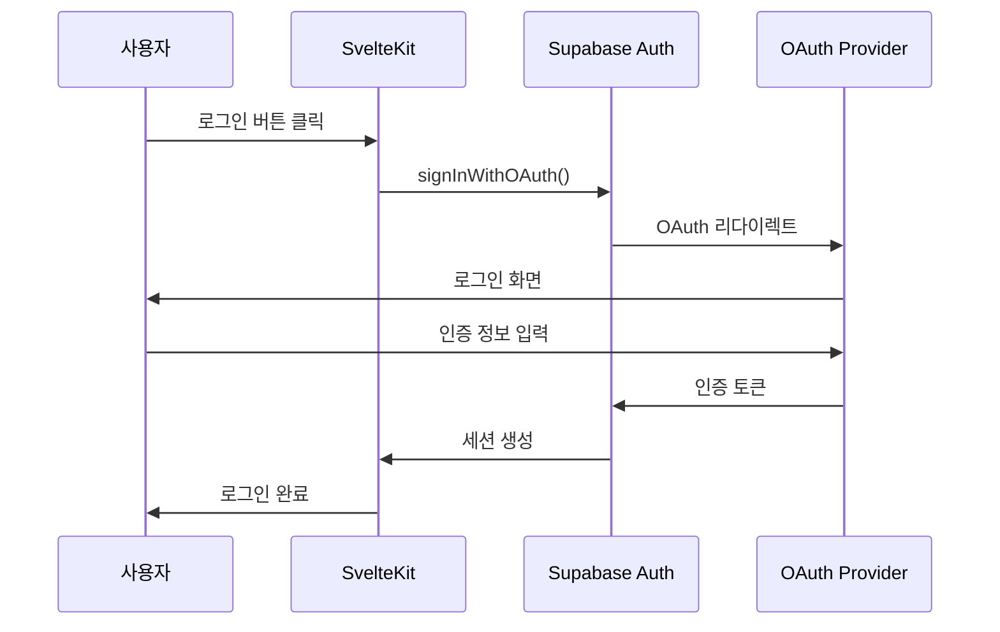
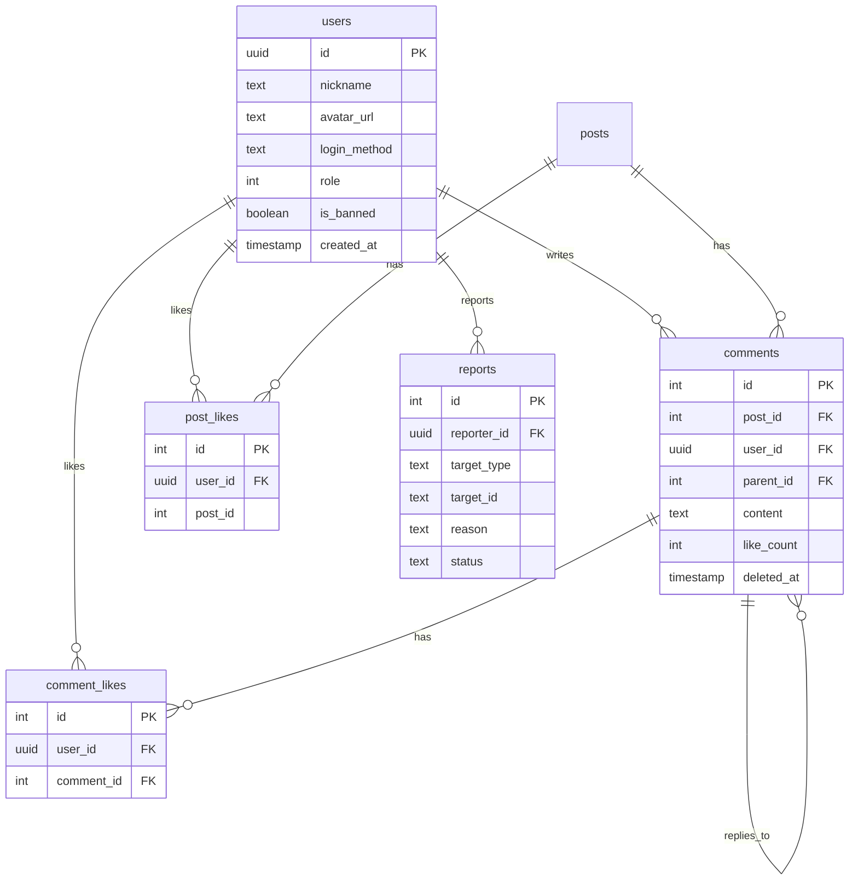

# SvelteKit 웹 애플리케이션 기획서

## 📋 개요

크롤링된 유머 게시글을 사용자에게 제공하는 웹 서비스

---

## 🔐 인증 (Authentication)

### 기술 스택
- **Supabase Auth** - 인증 백엔드
- **SvelteKit Auth Helpers** - 서버/클라이언트 통합

### OAuth 제공자

| 제공자 | 상태 | 비고 |
|--------|------|------|
| 카카오 | ✅ 확정 | 한국 사용자 대상 필수 |
| 구글 | ✅ 확정 | 범용 |
| ~~페이스북~~ | ❌ 제외 | - |
| ~~애플~~ | ❌ 제외 | - |

### 인증 흐름



---

## 🛡️ 인가 (Authorization)

### 역할 정의

| 역할 | 레벨 | 권한 |
|------|------|------|
| **비로그인(Guest)** | 0 | 게시글 보기만 가능 |
| **유저(User)** | 1 | 게시글 보기 + 댓글 작성 |
| **관리자(Admin)** | 99 | 모든 권한 |

### 기능별 권한 매트릭스

| 기능 | Guest | User | Admin |
|------|:-----:|:----:|:-----:|
| 게시글 목록 보기 | ✅ | ✅ | ✅ |
| 게시글 상세 보기 | ✅ | ✅ | ✅ |
| 이미지 보기 | ✅ | ✅ | ✅ |
| 게시글 검색 | ✅ | ✅ | ✅ |
| 댓글 읽기 | ✅ | ✅ | ✅ |
| 댓글 작성 | ❌ | ✅ | ✅ |
| 대댓글 작성 | ❌ | ✅ | ✅ |
| 댓글 수정/삭제 (본인) | ❌ | ✅ | ✅ |
| 댓글 좋아요 | ❌ | ✅ | ✅ |
| 게시글 좋아요 | ❌ | ✅ | ✅ |
| 신고하기 | ❌ | ✅ | ✅ |
| 댓글 삭제 (타인) | ❌ | ❌ | ✅ |
| 게시글 삭제/숨김 | ❌ | ❌ | ✅ |
| 사용자 관리/차단 | ❌ | ❌ | ✅ |
| 신고 관리 | ❌ | ❌ | ✅ |
| 크롤링 관리 | ❌ | ❌ | ✅ |
| 통계 대시보드 | ❌ | ❌ | ✅ |

> [!IMPORTANT]
> **중복 게시물 처리**: 웹앱에서는 **원본 게시물만** 표시합니다.
> - 크롤러에서 중복 감지 시 `related_post_id`에 원본 ID 저장
> - 웹앱 쿼리: `WHERE related_post_id IS NULL`
> - 중복 게시물은 관리자 페이지에서만 확인 가능

---

## ❓ 결정 필요 사항

아직 결정되지 않은 부분에 대한 제안입니다:

### 1. 유저 기능 확장

| 기능 | 제안 | 우선순위 | 결정 |
|------|------|----------|------|
| 댓글 좋아요 | 댓글에 좋아요 기능 추가 | 🟡 중간 | ✅ 채택 |
| 대댓글 | 댓글에 답글 기능 | 🟡 중간 | ✅ 채택 |
| 북마크 | 게시글 저장 기능 | 🟢 낮음 | 🔜 추후 검토 |
| 프로필 페이지 | 내 댓글/북마크 모아보기 | 🟢 낮음 | 🔜 추후 검토 |
| 알림 | 내 댓글에 답글 시 알림 | 🟢 낮음 | 🔜 추후 검토 |

### 2. 관리자 기능

| 기능 | 제안 | 우선순위 | 결정 |
|------|------|----------|------|
| 게시글 삭제/숨김 | 부적절한 게시글 관리 | 🔴 높음 | ✅ 채택 |
| 댓글 삭제 | 부적절한 댓글 관리 | 🔴 높음 | ✅ 채택 |
| 사용자 차단 | 악성 사용자 차단 | 🟡 중간 | ✅ 채택 |
| 크롤링 관리 | 웹에서 크롤링 실행/설정 | 🟡 중간 | ✅ 채택 |
| 통계 대시보드 | 방문자, 인기 게시글 등 | 🟢 낮음 | ✅ 채택 |
| 신고 관리 | 사용자 신고 처리 | 🟡 중간 | ✅ 채택 |

### 3. 게시글 관련

| 기능 | 제안 | 우선순위 | 결정 |
|------|------|----------|------|
| 좋아요 | 게시글 좋아요 (조회수 외 지표) | 🟡 중간 | ✅ 채택 |
| 공유하기 | SNS 공유 버튼 | 🟢 낮음 | 🔜 추후 검토 |
| 검색 | 제목/내용 검색 (FTS) | 🟡 중간 | ✅ 채택 |
| 카테고리/태그 | 게시글 분류 | 🟢 낮음 | 🔜 추후 검토 |
| 조회수 표시 | 인기 게시글 판단 | 🟡 중간 | 🔜 추후 검토 |

---

## 🗄️ 데이터베이스 스키마 (SQLite 통합)

### 기존 테이블 (크롤러)
- `posts` - 게시글
- `images` - 이미지

### 신규 테이블 (웹앱)

> **Note**: 모든 테이블이 단일 SQLite DB (`app.db`)에 통합됩니다.
> `user_id`는 Supabase Auth의 UUID를 TEXT로 저장합니다.

#### `users` (Supabase Auth와 연동)
```sql
CREATE TABLE users (
    id TEXT PRIMARY KEY,              -- Supabase Auth UUID (TEXT로 저장)
    nickname TEXT,
    avatar_url TEXT,
    login_method TEXT NOT NULL,       -- 'kakao', 'google'
    role INTEGER DEFAULT 1,           -- 1: User, 99: Admin
    is_banned INTEGER DEFAULT 0,      -- SQLite: 0=false, 1=true
    banned_at TEXT,                   -- ISO 8601 datetime
    banned_reason TEXT,
    created_at TEXT DEFAULT (datetime('now')),
    updated_at TEXT DEFAULT (datetime('now'))
);

-- 인덱스
CREATE INDEX idx_users_role ON users(role);
CREATE INDEX idx_users_login_method ON users(login_method);
```

#### `comments` (대댓글 지원)
```sql
CREATE TABLE comments (
    id INTEGER PRIMARY KEY AUTOINCREMENT,
    post_id INTEGER NOT NULL REFERENCES posts(id) ON DELETE CASCADE,
    user_id TEXT NOT NULL REFERENCES users(id) ON DELETE CASCADE,
    parent_id INTEGER REFERENCES comments(id) ON DELETE CASCADE,  -- 대댓글용
    content TEXT NOT NULL,
    like_count INTEGER DEFAULT 0,     -- 비정규화: 좋아요 수 캐시
    created_at TEXT DEFAULT (datetime('now')),
    updated_at TEXT DEFAULT (datetime('now')),
    deleted_at TEXT                   -- soft delete
);

-- 인덱스
CREATE INDEX idx_comments_post_id ON comments(post_id);
CREATE INDEX idx_comments_user_id ON comments(user_id);
CREATE INDEX idx_comments_parent_id ON comments(parent_id);
```

#### `post_likes` (게시글 좋아요)
```sql
CREATE TABLE post_likes (
    id INTEGER PRIMARY KEY AUTOINCREMENT,
    user_id TEXT NOT NULL REFERENCES users(id) ON DELETE CASCADE,
    post_id INTEGER NOT NULL REFERENCES posts(id) ON DELETE CASCADE,
    created_at TEXT DEFAULT (datetime('now')),
    UNIQUE(user_id, post_id)
);

-- 인덱스
CREATE INDEX idx_post_likes_post_id ON post_likes(post_id);
CREATE INDEX idx_post_likes_user_id ON post_likes(user_id);
```

#### `comment_likes` (댓글 좋아요)
```sql
CREATE TABLE comment_likes (
    id INTEGER PRIMARY KEY AUTOINCREMENT,
    user_id TEXT NOT NULL REFERENCES users(id) ON DELETE CASCADE,
    comment_id INTEGER NOT NULL REFERENCES comments(id) ON DELETE CASCADE,
    created_at TEXT DEFAULT (datetime('now')),
    UNIQUE(user_id, comment_id)
);

-- 인덱스
CREATE INDEX idx_comment_likes_comment_id ON comment_likes(comment_id);
```

#### `reports` (신고)
```sql
CREATE TABLE reports (
    id INTEGER PRIMARY KEY AUTOINCREMENT,
    reporter_id TEXT REFERENCES users(id) ON DELETE SET NULL,
    target_type TEXT NOT NULL,        -- 'post', 'comment', 'user'
    target_id TEXT NOT NULL,          -- post_id, comment_id, 또는 user_id
    reason TEXT NOT NULL,             -- 신고 사유
    description TEXT,                 -- 상세 설명
    status TEXT DEFAULT 'pending',    -- 'pending', 'reviewed', 'resolved', 'dismissed'
    reviewed_by TEXT REFERENCES users(id),
    reviewed_at TEXT,
    created_at TEXT DEFAULT (datetime('now'))
);

-- 인덱스
CREATE INDEX idx_reports_status ON reports(status);
CREATE INDEX idx_reports_target ON reports(target_type, target_id);
```

#### `bookmarks` (추후 검토)
```sql
-- 추후 구현 예정
CREATE TABLE bookmarks (
    id INTEGER PRIMARY KEY AUTOINCREMENT,
    user_id TEXT NOT NULL REFERENCES users(id) ON DELETE CASCADE,
    post_id INTEGER NOT NULL REFERENCES posts(id) ON DELETE CASCADE,
    created_at TEXT DEFAULT (datetime('now')),
    UNIQUE(user_id, post_id)
);
```

### 📊 ER 다이어그램



---

## 📱 페이지 구조

### 라우트 설계

```
src/routes/
├── +page.svelte                    # 메인 (게시글 목록)
├── +layout.svelte                  # 공통 레이아웃
├── +layout.server.ts               # 세션 체크
│
├── post/[id]/
│   ├── +page.svelte               # 게시글 상세
│   └── +page.server.ts            # 게시글 + 댓글 로드
│
├── auth/
│   ├── login/+page.svelte         # 로그인 페이지
│   ├── callback/+server.ts        # OAuth 콜백
│   └── logout/+server.ts          # 로그아웃
│
├── my/                             # 로그인 필요
│   ├── +page.svelte               # 마이페이지
│   ├── comments/+page.svelte      # 내 댓글
│   └── bookmarks/+page.svelte     # 북마크
│
└── admin/                          # 관리자 전용
    ├── +layout.server.ts          # 관리자 권한 체크
    ├── +page.svelte               # 대시보드
    ├── posts/+page.svelte         # 게시글 관리
    ├── comments/+page.svelte      # 댓글 관리
    ├── users/+page.svelte         # 사용자 관리
    └── crawler/+page.svelte       # 크롤러 관리
```

---

## 🎨 UI/UX 고려사항

### 디자인 시스템
- **스타일**: 모던, 다크모드 옵션
- **레이아웃**: 카드 기반 그리드
- **반응형**: 모바일 우선

### 주요 컴포넌트

| 컴포넌트 | 설명 |
|----------|------|
| `PostCard` | 목록용 게시글 카드 |
| `PostDetail` | 상세 페이지 본문 |
| `ImageGallery` | 이미지 갤러리/슬라이더 |
| `CommentList` | 댓글 목록 |
| `CommentForm` | 댓글 입력 폼 |
| `AuthButton` | 로그인/로그아웃 버튼 |
| `Pagination` | 페이지네이션 |
| `SearchBar` | 검색창 (선택적) |

---

## 🚀 구현 단계

### Phase 1: 기본 기능 (MVP)
- [ ] SvelteKit 프로젝트 초기화
- [ ] Supabase 연동
- [ ] 게시글 목록/상세 페이지
- [ ] OAuth 로그인 (카카오, 구글)
- [ ] 기본 댓글 기능

### Phase 2: 사용자 경험 개선
- [ ] 이미지 갤러리 최적화
- [ ] 페이지네이션
- [ ] 검색 기능
- [ ] 반응형 디자인

### Phase 3: 관리자 기능
- [ ] 관리자 대시보드
- [ ] 게시글/댓글 관리
- [ ] 사용자 관리

### Phase 4: 고급 기능
- [ ] 좋아요/북마크
- [ ] 알림 시스템
- [ ] 통계 대시보드

---

## 🔧 기술 스택 상세

| 카테고리 | 기술 | 용도 |
|----------|------|------|
| 프레임워크 | SvelteKit | 풀스택 웹 프레임워크 |
| 언어 | TypeScript | 타입 안전성 |
| 스타일링 | Tailwind CSS + **shadcn-svelte** | 유틸리티 CSS + 컴포넌트 |
| 인증 | Supabase Auth | OAuth (카카오, 구글) |
| 데이터베이스 | **SQLite (WAL 모드)** | 모든 데이터 통합 관리 |
| 이미지 | Cloudflare R2 | 이미지 스토리지 |
| 배포 | **Railway** | 컨테이너 기반 배포 |

---

## 💡 추가 고려사항

### 1. 데이터베이스 전략 ✅

**SQLite 단일 DB로 통합**

```
data/
└── app.db          # 모든 데이터 통합 (WAL 모드)
    ├── posts       # 크롤링된 게시글
    ├── images      # 이미지 메타데이터
    ├── users       # 사용자 (인증은 Supabase Auth)
    ├── comments    # 댓글/대댓글
    ├── post_likes  # 게시글 좋아요
    ├── comment_likes # 댓글 좋아요
    └── reports     # 신고
```

#### 역할 분담

| 테이블 | 크롤러 (Python) | 웹앱 (SvelteKit) |
|--------|:---------------:|:----------------:|
| `posts` | ✍️ 쓰기 | 👁️ 읽기만 |
| `images` | ✍️ 쓰기 | 👁️ 읽기만 |
| `users` | ❌ | ✍️ 읽기/쓰기 |
| `comments` | ❌ | ✍️ 읽기/쓰기 |
| `post_likes` | ❌ | ✍️ 읽기/쓰기 |
| `comment_likes` | ❌ | ✍️ 읽기/쓰기 |
| `reports` | ❌ | ✍️ 읽기/쓰기 |

#### SQLite 라이브러리

| 구성요소 | 라이브러리 | ORM |
|----------|-----------|-----|
| 크롤러 (Python) | SQLAlchemy | SQLAlchemy ORM |
| 웹앱 (SvelteKit) | **better-sqlite3** | **Drizzle ORM** |

#### SQLite PRAGMA 설정 (양쪽 동일)

```sql
PRAGMA journal_mode=WAL;        -- 동시 읽기/쓰기 지원
PRAGMA synchronous=NORMAL;      -- 성능과 안정성 균형
PRAGMA cache_size=-64000;       -- 64MB 캐시
PRAGMA temp_store=MEMORY;       -- 임시 테이블 메모리 사용
PRAGMA mmap_size=268435456;     -- 256MB 메모리 매핑
PRAGMA busy_timeout=5000;       -- 잠금 대기 5초
```

**크롤러 (Python - SQLAlchemy):** ✅ 반영 완료
```python
# storage.py에 이미 적용됨
connection.execute(text("PRAGMA journal_mode=WAL"))
connection.execute(text("PRAGMA synchronous=NORMAL"))
# ... (나머지 PRAGMA)
```

**웹앱 (SvelteKit - better-sqlite3):**
```typescript
// src/lib/server/db.ts
import Database from 'better-sqlite3';
import { drizzle } from 'drizzle-orm/better-sqlite3';

const sqlite = new Database('data/app.db');

// PRAGMA 설정
sqlite.pragma('journal_mode = WAL');
sqlite.pragma('synchronous = NORMAL');
sqlite.pragma('cache_size = -64000');
sqlite.pragma('temp_store = MEMORY');
sqlite.pragma('mmap_size = 268435456');
sqlite.pragma('busy_timeout = 5000');

export const db = drizzle(sqlite);
```

**장점:**
- 아키텍처 단순화
- 외부 의존성 최소화
- 비용 절감 (Supabase PostgreSQL 불필요)
- 백업/복원 용이

**주의사항:**
- WAL 모드 필수 (동시 읽기/쓰기)
- Railway 볼륨 마운트 필요
- 크롤러와 웹앱이 같은 DB 파일에 접근

---

### 2. 보안 ✅ 확정

| 보안 기능 | 상태 | 구현 방법 |
|----------|------|----------|
| CSRF 보호 | ✅ 채택 | SvelteKit 내장 CSRF 토큰 |
| Rate Limiting | ✅ 채택 | 댓글 작성 제한 (N초당 1개) |
| XSS 방지 | ✅ 채택 | DOMPurify로 댓글 입력 sanitize |

**Rate Limiting 예시:**
```typescript
// 댓글 작성 제한: 10초당 1개
const RATE_LIMIT = {
  comments: { window: 10000, max: 1 },
  likes: { window: 1000, max: 5 },
  reports: { window: 60000, max: 3 }
};
```

---

### 3. 성능 ✅ 확정

| 기능 | 상태 | 설명 |
|------|------|------|
| 이미지 Lazy Loading | ✅ 채택 | Intersection Observer 사용 |
| 페이지네이션 | ✅ 채택 | 무한 스크롤 X, 본 페이지네이션 사용 |
| 캐싱 전략 (ISR/SSG) | ✅ 채택 | 게시글 목록 SSG + 상세 ISR |

**캐싱 전략 상세:**

```typescript
// +page.server.ts
export const config = {
  isr: {
    expiration: 60  // 60초마다 재생성
  }
};

// 게시글 목록: SSG (빌드 시 생성)
// 게시글 상세: ISR (60초 캐시)
// 댓글: CSR (실시간 로드)
```

**이미지 최적화:**
```svelte
<script>
  import { onMount } from 'svelte';
  
  let imageRef: HTMLImageElement;
  let isLoaded = false;
  
  onMount(() => {
    const observer = new IntersectionObserver((entries) => {
      if (entries[0].isIntersecting) {
        isLoaded = true;
        observer.disconnect();
      }
    });
    observer.observe(imageRef);
  });
</script>

{#if isLoaded}
  
{:else}
  <div bind:this={imageRef} class="placeholder" />
{/if}
```

---

## 🛠️ 유지보수 및 운영 (Maintenance & Operations) ✅ 확정

### 1. 에러 모니터링: Sentry
- **목적**: 실시간 에러 추적 및 슬랙 알림 연동
- **구현**: `@sentry/sveltekit` 라이브러리로 클라이언트/서버 에러 통합 관리
- **범위**: 500 에러, API 실패, 예기치 못한 JS 런타임 에러

### 2. 방문자 분석: Cloudflare Web Analytics
- **목적**: 개인정보를 보호하면서 가벼운 방문자 데이터 분석
- **구현**: Cloudflare Beacon 스크립트 삽입 (`app.html`)
- **지표**: 페이지뷰, 고유 방문자, 유입 경로, 인기 콘텐츠

### 3. 백업 전략 (daily R2 backup)
- **주기**: 매일 새벽 3시 (정기 배치)
- **방법**: `WAL checkpoint` 처리 후 SQLite 파일을 별도 백업 디렉토리에 복사하여 R2 업로드
- **보관 기간**: 최근 7일치 유지 (7일 이전 데이터 자동 삭제)
- **검증**: 백업 완료 시 로그 기록 및 용량 체크

---

## 📱 모바일 대응 전략 ✅ 확정

- **현재**: 웹 우선 (반응형 모바일 뷰 최적화)
- **향후 확장**: PWA(Progressive Web App) 우선 고려, 필요시 Capacitor.js를 통한 네이티브 앱화 검토
- **최적화**: 모바일 터치 타겟 크기 확보, 네트워크 대역폭 고려 이미지 압축 우선 적용

