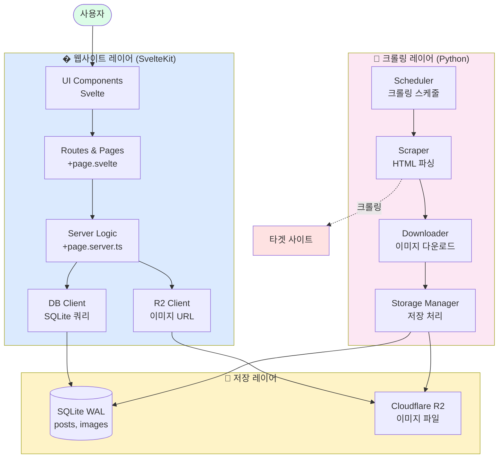
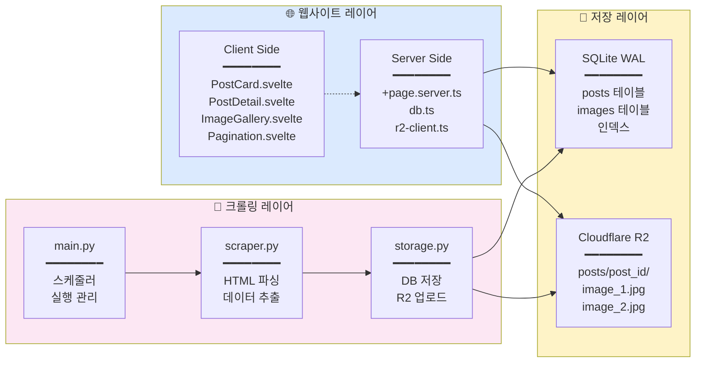
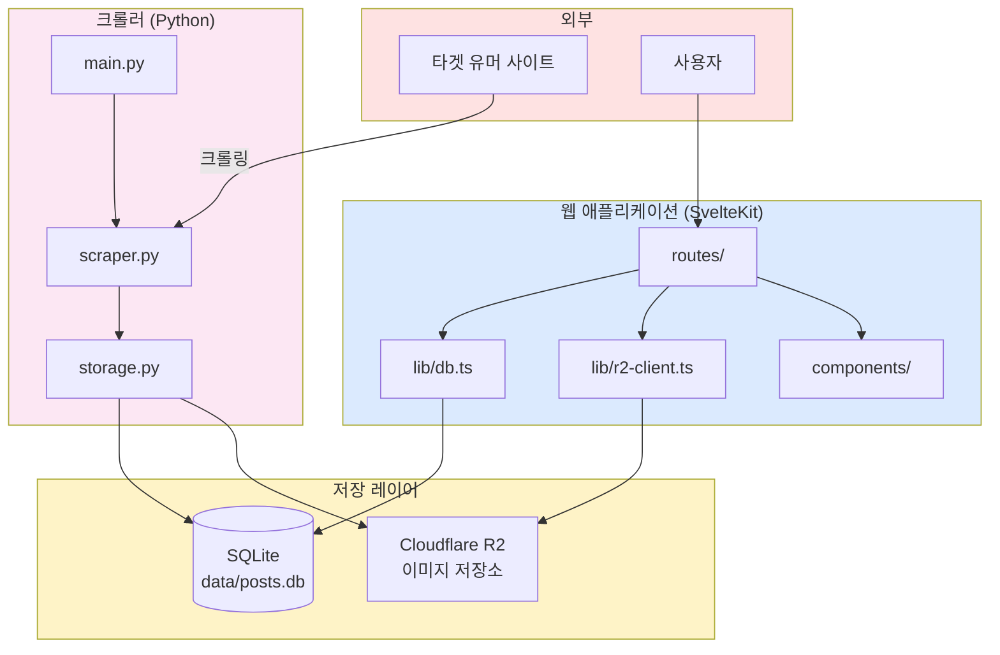
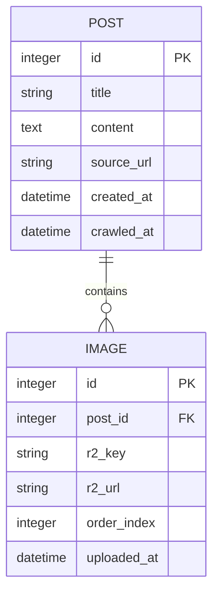
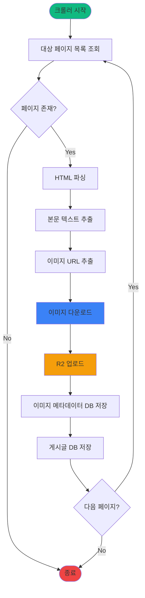
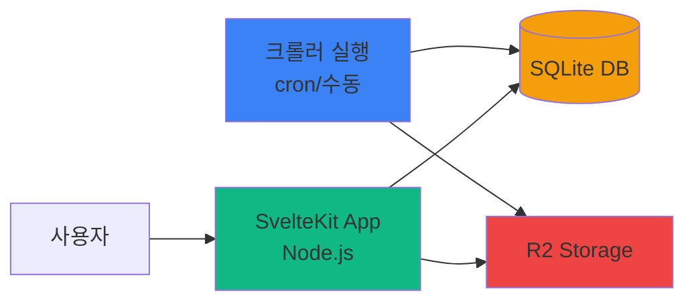

# 유머글 크롤링 사이트 프로젝트 기획서

## 프로젝트 개요

유머 커뮤니티 사이트의 게시글(본문 텍스트 + 이미지)을 크롤링하여 저장하고, 웹 인터페이스로 제공하는 서비스

## 기술 스택

- **크롤러**: Python (BeautifulSoup4, Requests, boto3, SQLAlchemy, APScheduler, Pillow, imagehash)
- **웹 프론트엔드/백엔드**: SvelteKit
- **데이터베이스**: SQLite (WAL 모드)
- **이미지 스토리지**: Cloudflare R2

## 시스템 아키텍처

### 3-Layer 구조



### 레이어별 상세 구조



### 레이어별 책임

#### 🌐 웹사이트 레이어 (SvelteKit)

- **역할**: 사용자에게 웹 인터페이스 제공
- **기술 스택**: SvelteKit, TypeScript, Tailwind CSS
- **주요 기능**:
  - 게시글 목록/상세 페이지 렌더링
  - 이미지 갤러리 표시
  - 페이지네이션 처리
  - SQLite 데이터 조회
  - R2 이미지 URL 생성
- **파일 구조**:
  ```
  src/
  ├── routes/
  │   ├── +page.svelte              # 목록 페이지
  │   ├── +page.server.ts           # 목록 로더
  │   └── post/[id]/
  │       ├── +page.svelte          # 상세 페이지
  │       └── +page.server.ts       # 상세 로더
  └── lib/
      ├── db.ts                     # SQLite 클라이언트
      ├── r2-client.ts              # R2 URL 생성
      └── components/
          ├── PostCard.svelte
          ├── ImageGallery.svelte
          └── Pagination.svelte
  ```

#### 💾 저장 레이어 (SQLite + R2)

- **역할**: 데이터 영속성 및 파일 저장
- **기술 스택**: SQLite WAL, Cloudflare R2
- **주요 기능**:
  - 게시글 메타데이터 저장 (SQLite)
  - 이미지 파일 저장 (R2)
  - 동시 읽기/쓰기 지원 (WAL 모드)
- **데이터 구조**:
  - **SQLite**: `posts`, `images` 테이블
  - **R2**: `posts/{post_id}/image_{n}.jpg`

#### 🤖 크롤링 레이어 (Python)

- **역할**: 타겟 사이트에서 데이터 수집 및 저장
- **기술 스택**: Python, BeautifulSoup4, Requests, boto3, SQLAlchemy, APScheduler, Pillow, imagehash
- **주요 기능**:
  - **다중 사이트 지원**: 사이트별 선택자 설정 (TARGET_SITES)
  - **Early Stop**: 중복 감지 시 조기 중단
  - 타겟 사이트 HTML 파싱
  - 본문 텍스트 추출
  - 이미지 다운로드
  - SQLite에 메타데이터 저장
  - R2에 이미지 업로드
  - 중복 크롤링 방지
- **파일 구조**:
  ```
  crawler/
  ├── main.py           # 엔트리포인트, 스케줄러
  ├── scraper.py        # HTML 파싱, 데이터 추출
  ├── storage.py        # DB/R2 저장 로직
  ├── config.py         # 설정 (타겟 URL, credentials)
  └── requirements.txt  # 의존성
  ```

## 전체 프로젝트 구조

### 통합 디렉토리 구조

```
aagag_clone/
├── crawler/                    # Python 크롤러
│   ├── main.py                # 크롤러 엔트리포인트
│   ├── scraper.py             # HTML 파싱 로직
│   ├── storage.py             # DB/R2 저장 로직
│   ├── config.py              # 설정 파일
│   ├── requirements.txt       # Python 의존성
│   └── .env                   # 환경 변수 (git 제외)
│
├── data/                       # 데이터 저장소
│   └── posts.db               # SQLite 데이터베이스 (WAL 모드)
│
├── src/                        # SvelteKit 웹 애플리케이션
│   ├── routes/
│   │   ├── +page.svelte       # 메인 페이지 (게시글 목록)
│   │   ├── +page.server.ts    # 게시글 목록 로더
│   │   └── post/[id]/
│   │       ├── +page.svelte   # 게시글 상세
│   │       └── +page.server.ts # 게시글 상세 로더
│   │
│   ├── lib/
│   │   ├── db.ts              # SQLite 클라이언트
│   │   ├── r2-client.ts       # R2 URL 생성
│   │   └── components/
│   │       ├── PostCard.svelte # 게시글 카드
│   │       ├── PostDetail.svelte # 게시글 상세
│   │       ├── ImageGallery.svelte # 이미지 갤러리
│   │       └── Pagination.svelte # 페이지네이션
│   │
│   └── app.html               # HTML 템플릿
│
├── static/                     # 정적 파일
│   └── favicon.png
│
├── package.json               # Node.js 의존성
├── svelte.config.js           # SvelteKit 설정
├── tsconfig.json              # TypeScript 설정
├── vite.config.ts             # Vite 설정
│
└── docs/                       # 프로젝트 문서
    ├── project-plan.md        # 전체 기획서
    └── crawler/
        ├── architecture.md    # 크롤러 아키텍처
        ├── main.py.md
        ├── scraper.py.md
        ├── storage.py.md
        ├── config.py.md
        └── requirements.txt.md
```

### 데이터 흐름 (통합)



### 환경별 설정

#### 개발 환경

```bash
# 크롤러 실행
cd crawler
python -m venv venv
source venv/bin/activate
pip install -r requirements.txt
python main.py

# 웹 서버 실행 (다른 터미널)
npm install
npm run dev
```

#### 프로덕션 환경

```bash
# 크롤러 (Cron)
0 */2 * * * cd /path/to/crawler && python main.py

# 웹 서버
npm run build
node build
```

### 테스트 전략

#### 테스트 도구

- **pytest**: 테스트 프레임워크
- **pytest-cov**: 코드 커버리지 측정
- **responses**: HTTP 요청 모킹
- **ruff**: 코드 품질 검사 및 포매팅

#### 테스트 실행

```bash
# 단위 테스트
pytest tests/

# 커버리지 포함
pytest --cov=crawler --cov-report=html

# 코드 품질 검사
ruff check crawler/
ruff format crawler/
```

#### 테스트 디렉토리 구조

```
crawler/
├── tests/
│   ├── __init__.py
│   ├── conftest.py           # pytest 설정
│   ├── fixtures/             # 테스트 데이터
│   │   ├── sample_post.html
│   │   └── sample_list.html
│   ├── test_scraper.py
│   ├── test_storage.py
│   └── test_integration.py
```

## 데이터 모델



### 테이블 스키마

#### `posts` 테이블

| 컬럼       | 타입                | 설명        |
| ---------- | ------------------- | ----------- |
| id         | INTEGER PRIMARY KEY | 게시글 ID   |
| title      | TEXT NOT NULL       | 게시글 제목 |
| content    | TEXT                | 본문 텍스트 |
| source_url | TEXT UNIQUE         | 원본 URL    |
| created_at | DATETIME            | 원본 작성일 |
| crawled_at | DATETIME            | 크롤링 시각 |

#### `images` 테이블

| 컬럼        | 타입                | 설명           |
| ----------- | ------------------- | -------------- |
| id          | INTEGER PRIMARY KEY | 이미지 ID      |
| post_id     | INTEGER             | 게시글 ID (FK) |
| r2_key      | TEXT NOT NULL       | R2 저장 키     |
| r2_url      | TEXT                | R2 공개 URL    |
| order_index | INTEGER             | 이미지 순서    |
| uploaded_at | DATETIME            | 업로드 시각    |

## 크롤러 워크플로우



## 주요 컴포넌트

### 1. Python Crawler

**파일 구조**:

```
crawler/
├── main.py           # 크롤러 엔트리포인트
├── scraper.py        # HTML 파싱 로직
├── storage.py        # DB/R2 저장 로직
├── config.py         # 설정 (타겟 URL, R2 credentials)
└── requirements.txt  # 의존성
```

**핵심 기능**:

- 타겟 사이트 HTML 파싱
- 본문 텍스트 추출
- 이미지 다운로드 및 R2 업로드
- SQLite에 메타데이터 저장
- 중복 크롤링 방지 (source_url UNIQUE)

### 2. SvelteKit 웹 애플리케이션

**파일 구조**:

```
src/
├── routes/
│   ├── +page.svelte           # 메인 페이지 (게시글 목록)
│   ├── +page.server.ts        # 게시글 목록 로드
│   └── post/[id]/
│       ├── +page.svelte       # 게시글 상세
│       └── +page.server.ts    # 게시글 상세 로드
├── lib/
│   ├── db.ts                  # SQLite 연결
│   └── components/
│       ├── PostCard.svelte    # 게시글 카드
│       └── ImageGallery.svelte # 이미지 갤러리
└── app.html
```

**핵심 기능**:

- 게시글 목록 표시 (페이지네이션)
- 게시글 상세 보기
- 이미지 갤러리 뷰
- 반응형 디자인

### 3. SQLite 데이터베이스 (WAL 모드)

**WAL 모드 설정**:

```sql
PRAGMA journal_mode=WAL;
PRAGMA synchronous=NORMAL;
```

**장점**:

- 읽기/쓰기 동시성 향상
- 크롤러가 쓰는 동안 웹앱 조회 가능

### 4. Cloudflare R2 스토리지

**저장 구조**:

```
bucket/
└── posts/
    └── {post_id}/
        ├── image_1.jpg
        ├── image_2.jpg
        └── ...
```

**설정**:

- Public 버킷 또는 Signed URL 사용
- 이미지 최적화 (선택사항)

## 배포 및 실행



### 크롤러

- **실행 방식**: Cron job 또는 수동 실행
- **주기**: 1시간마다 / 하루 1회 등

### 웹 애플리케이션

- **배포**: Vercel, Cloudflare Pages, 또는 VPS
- **빌드**: `npm run build`
- **실행**: Node.js adapter

## 개발 단계

### Phase 1: 크롤러 개발

- [ ] 타겟 사이트 HTML 구조 분석
- [ ] 파싱 로직 구현
- [ ] R2 업로드 구현
- [ ] SQLite 저장 로직 구현

### Phase 2: 데이터베이스 설계

- [ ] 스키마 정의
- [ ] WAL 모드 설정
- [ ] 인덱스 최적화

### Phase 3: 웹 애플리케이션 개발

- [ ] SvelteKit 프로젝트 초기화
- [ ] DB 연결 설정
- [ ] 게시글 목록 페이지
- [ ] 게시글 상세 페이지
- [ ] UI/UX 개선

### Phase 4: 통합 및 테스트

- [ ] 크롤러-DB 연동 테스트
- [ ] 웹앱-DB 연동 테스트
- [ ] 이미지 로딩 테스트
- [ ] 성능 최적화

## 주요 고려사항

> [!IMPORTANT] > **법적 이슈**: 크롤링 대상 사이트의 robots.txt 및 이용약관 확인 필수

> [!WARNING] > **Rate Limiting**: 과도한 요청으로 인한 IP 차단 방지를 위해 요청 간격 조절 필요

> [!TIP] > **이미지 최적화**: R2 업로드 전 이미지 리사이징/압축으로 스토리지 비용 절감 가능

## 예상 비용

| 항목             | 예상 비용                                  |
| ---------------- | ------------------------------------------ |
| Cloudflare R2    | 월 $0.015/GB (저장) + $0.36/million (요청) |
| SvelteKit 호스팅 | Vercel/CF Pages 무료 티어 가능             |
| 서버 (크롤러)    | VPS $5-10/월 또는 로컬 실행                |

## 확장 가능성

- 검색 기능 (FTS5)
- 좋아요/북마크 기능
- 댓글 크롤링
- 여러 사이트 지원
- 관리자 대시보드
